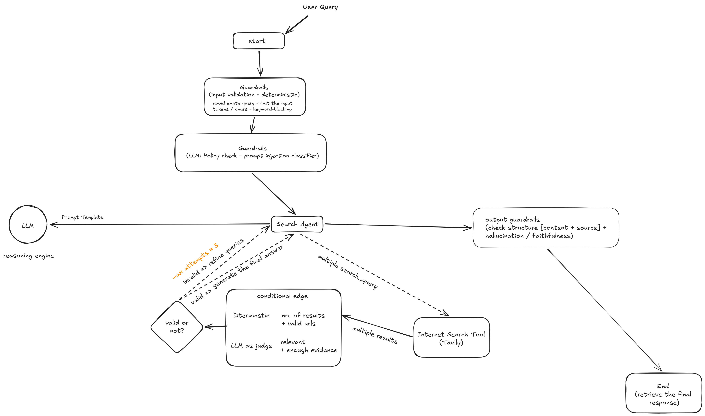

# AI Web Search Agent

A LangChain-powered AI agent that searches the web in response to natural-language queries, using a free Hugging Face LLM and the Tavily Search API.

## Overview

This project demonstrates how to build an AI agent that combines a large language model with real-time web search capabilities. The user provides a query in plain English, and the agent:

1. Passes the query to **DeepSeek-V4-Flash-0731** (a free model hosted on Hugging Face).
2. Uses **Tavily** to retrieve relevant web results.
3. Returns a structured response containing a concise **answer** and a list of **sources** (title + URL).

## Recommended Architecture

For a production-ready web-search assistant, the architecture should separate user interaction, policy checks, retrieval, and answer validation into distinct stages. This pattern improves resilience, observability, and scalability while reducing the chance of low-quality or unsupported answers.



### Why this architecture is recommended

- Input guardrails: validate and normalize the user prompt before it reaches the model.
- Policy and routing layer: classify whether a query needs web search, answer generation, or a fallback path.
- Search agent loop: issue controlled retrieval requests and evaluate whether the search results are relevant and sufficient.
- Output validation: check that the final answer has structure, source grounding, and no hallucinated claims.
- Deterministic control flow: separate LLM reasoning from deterministic validation and fallback logic to make the system more reliable.
- Scalability: the design can later be extended with async workers, caching, rate limiting, and monitoring without changing the whole application structure.

This diagram represents a practical pattern for moving from a simple prototype into a more robust AI system that can be reliably deployed and scaled.

## Tech Stack

| Component | Technology |
|---|---|
| Language | Python 3.12 |
| Package Manager | [uv](https://github.com/astral-sh/uv) |
| Agent Framework | [LangChain](https://python.langchain.com/) |
| LLM | [DeepSeek-V4-Flash-0731](https://huggingface.co/deepseek-ai/DeepSeek-V4-Flash-0731) via Hugging Face Inference API |
| Web Search | [Tavily Search API](https://tavily.com/) |
| Output Validation | [Pydantic](https://docs.pydantic.dev/) |
| Observability | [LangSmith](https://smith.langchain.com/) |

## Project Structure

```
web-search-agent/
├── .env                # Environment variables (API keys) — not committed
├── .gitignore          # Git ignore rules
├── main.py             # Application entry point (single-file agent)
├── pyproject.toml      # Project metadata and dependencies
├── uv.lock             # Locked dependency versions
└── README.md           # This file
```

## Prerequisites

- Python 3.12 or later
- [uv](https://github.com/astral-sh/uv) package manager
- A free [Hugging Face](https://huggingface.co/) account and API token
- A free [Tavily](https://tavily.com/) API key
- (Optional) A [LangSmith](https://smith.langchain.com/) account for tracing

## Setup

1. **Clone the repository**

   ```bash
   git clone https://github.com/Ahmed-Maher77/AI-Web-Search-Agent.git
   cd AI-Web-Search-Agent
   ```

2. **Create the virtual environment and install dependencies**

   ```bash
   uv venv
   uv sync
   ```

3. **Configure environment variables**

   Create a `.env` file in the project root with the following keys:

   ```env
   TAVILY_API_KEY=tvly-xxxxxxxxxxxxxxxxxxxxx
   HUGGINGFACEHUB_API_TOKEN=hf_xxxxxxxxxxxxxxxxxxxxx
   LANGSMITH_API_KEY=lsv2_pt_xxxxxxxxxxxxxxxxxxxxx
   LANGSMITH_TRACING=true
   ```

   > **Never commit your `.env` file to version control.** It is excluded via `.gitignore` by default.

## Usage

Run the agent interactively:

```bash
uv run main.py
```

You will be prompted to enter a search query:

```
Please enter what you want me to search the web for: What is LangChain?
```

The agent will return a structured answer along with the sources it used:

```
The agent has found the following answer and sources:
Answer: LangChain is a framework for building applications powered by large language models...

Sources:
Title: LangChain Documentation, URL: https://python.langchain.com/docs/
Title: LangChain GitHub, URL: https://github.com/langchain-ai/langchain
```

## How It Works

1. **LLM Initialization** — A `HuggingFaceEndpoint` is created pointing to the DeepSeek-V4-Flash model, wrapped in a `ChatHuggingFace` instance.
2. **Tool Registration** — The `TavilySearch` tool is registered with the agent so it can query the web.
3. **Structured Output** — A Pydantic schema (`AgentResponse`) defines the expected output format (answer + sources), enforced at runtime via `ProviderStrategy`.
4. **Agent Execution** — The agent receives the user's message, reasons about whether a web search is needed, retrieves results, and returns the structured response.

## License

This project is for educational purposes. Feel free to adapt and use it in your own work.
